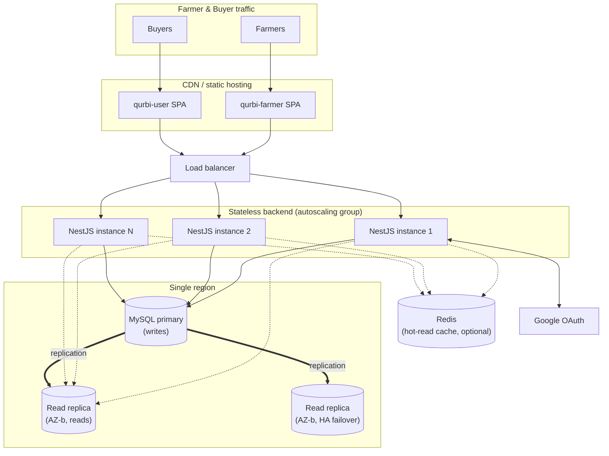

# QURBI — Deployment Architecture

Target market: Malaysia only. No geographic latency justification for
multi-data-center replication — single region is sufficient. Farmer/user
differentiation happens at the **frontend and compute layer** (independent
SPAs, independently scaled stateless backend instances), not by splitting
the database. One shared MySQL database / one `users` table is required for
shared Google auth to work (same account logs into both apps as the same
user).

## Diagram

## Components

### Frontends — real farmer/user differentiation happens here
- `qurbi-farmer` and `qurbi-user` are separate SPAs, independently built,
  versioned, and deployed to a CDN (e.g. CloudFront+S3, Cloud CDN+Cloud
  Storage, or any static host).
- A release, outage, or traffic spike on one app cannot affect the other —
  this is the isolation boundary, not a second database.

### Backend — one NestJS API, horizontally scaled
- Stateless: auth is JWT + DB-backed refresh tokens, so any instance can
  serve any request — no sticky sessions needed.
- Runs as N instances behind a load balancer, autoscaling on CPU/request
  load.
- **Caveat carried over from the Google OAuth implementation**: the
  in-memory OAuth ticket store (`TicketStoreService`) only works correctly
  with a single instance or sticky sessions during the login redirect. Once
  this runs as >1 instance, move it to the shared MySQL DB or Redis so a
  ticket created on instance A is visible to instance B.

### Database — one region, one primary, read replicas
- Single MySQL primary handles all writes (orders, listings, verification,
  auth). One `users` table — the same Google account resolves to the same
  row from either app.
- Read replica(s) absorb read-heavy traffic (browsing/search listings)
  without touching the primary.
- A replica in a second availability zone (same region) gives failover/HA —
  this is the legitimate reason for "a second location," not per-app data
  splitting. An order needs a farmer's listing and a buyer's cart to be
  consistent in one place; splitting them across databases would require
  distributed transactions for no real benefit at this scale.

### Cache (optional, add when read load actually demands it)
- Redis in front of hot read paths (livestock browse/search) absorbs most
  of the load a second data center would have been solving, far more
  cheaply.

## What this deliberately avoids
- Two data centers / two databases split by app — recreates the "separate
  users table" problem the shared-auth work was built to eliminate, and
  adds distributed-transaction complexity for data (orders, users) that is
  inherently cross-cutting between farmer and buyer.
- Multi-region replication — no latency case for it with a Malaysia-only
  target.

## Open items (fill in once a hosting provider is chosen)
- [ ] Provider: AWS (ap-southeast-1) / GCP (asia-southeast1) / Malaysia-local
      (data-residency requirement?)
- [ ] Managed DB (RDS/Cloud SQL) vs. self-managed MySQL replication
- [ ] Autoscaling trigger thresholds for the backend instance group
- [ ] When to introduce Redis (define the read-load threshold)
